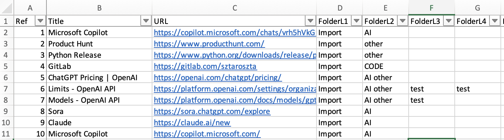
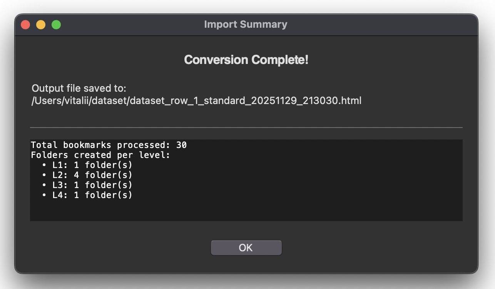
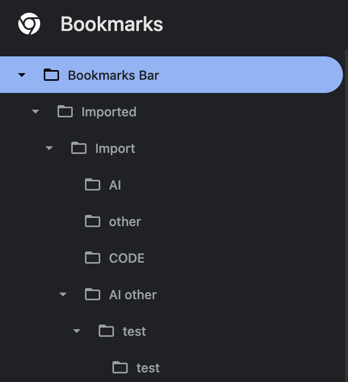

# NetscapeGen

A cross-platform GUI utility designed to convert structured Excel spreadsheets (.xlsx) into standard Netscape-format HTML bookmark files. This tool ensures your bookmark collections are portable and compatible with all major web browsers (Chrome, Safari, Firefox, Edge) 📑 ➡️ 🌐


<p align="center">  </p>

**➡️ Read more about the project, its features, and development in my [Medium story.](https://medium.com/@starosta/excel-to-browser-bookmarks-5a60da8864d8)** 


## Table of Contents

- [Overview](#overview)
- [Key Features](#key-features)
- [Installation](#installation)
- [Usage](#usage)
- [Project Structure](#project-structure)
- [Development](#development)
- [Known Issues](#known-issues)
- [Contributing](#contributing)
- [License](#license)
- [Contact](#contact)

## Overview

NetscapeGen bridges the gap between data organization in Excel and browser utility. It provides a streamlined, graphical interface to transform flat Excel tables into hierarchical, nested bookmark structures.

Instead of manually creating folders and saving links one by one, NetscapeGen allows you to maintain your library in a clean spreadsheet and export it directly to an HTML file that can be imported into any browser.

The core strength of NetscapeGen is its dynamic structure detection. It scans your Excel columns for folder levels (e.g., FolderL1, FolderL2) and automatically builds the corresponding nested tree structure, regardless of how deep the hierarchy goes.

Problem it Solves:
-   **Migration:** Easily move bulk links from spreadsheets into a usable browser format.
-   **Organization:** Manage complex folder hierarchies using the familiar grid interface of Excel.
-   **Compatibility:** Generates the universal Netscape Bookmark HTML standard used by virtually all browsers.

A typical workflow involves:
1.  Launching the script and defining your header configuration (Row 1 or 2).
2.  Selecting your local .xlsx input file.
3.  Choosing a save location for the generated HTML file.
4.  Watching the non-blocking progress window as the tool parses structure and generates code.
5.  Importing the resulting HTML file into your preferred web browser.


## Key Features

-   **Universal Browser Support:** Outputs standard Netscape HTML compatible with Chrome, Firefox, Safari, Edge, and Opera.
-   **Dynamic Folder Depth:** Automatically detects columns named FolderL1, FolderL2, etc., allowing for unlimited nesting depth without code changes.
-   **Smart Data Cleaning:** Handles missing values, sanitizes HTML special characters, and validates required columns (Title, URL) before processing.
-   **Flexible Header Config:** Built-in support for datasets where the actual headers start on Row 2 (common in reports with title rows).
-   **Real-Time Feedback:** Features a dedicated progress window that mirrors status updates to the console.
-   **Auto-Reveal:** Automatically opens the file location in your system's file manager (Finder, Explorer) upon completion.
-   **Cross-Platform GUI:** Built with tkinter and ttk, ensuring a native look and feel on macOS, Windows, and Linux.

## Installation

### Prerequisites

-   Python 3.7+
-   A graphical desktop environment is required to run the `tkinter`-based GUI.

### Clone the Repository

```bash
git clone https://github.com/sztaroszta/NetscapeGen.git
cd NetscapeGen
```

### Install Dependencies

You can install the required dependency using pip:

```bash
pip install -r requirements.txt
```

*Alternatively, install the dependency manually:*

```bash
pip install pandas openpyxl
```

## Usage

**1. Prepare your Excel File:**
Ensure your .xlsx file has at least two columns named Title and URL. To create folders, add columns named FolderL1, FolderL2, etc.
| Title | URL | FolderL1 | FolderL2 |
| :--- | :--- | :--- | :--- |
| GitHub | https://github.com | Development | Source Control |
| Google | https://google.com | Search | |

**2. Run the application:**

```bash
python excel_to_netscape.py
```


**3. Follow the GUI Prompts:**
*   **Header Configuration:** A dialog will ask if your headers are in Row 1 (Standard) or Row 2.

   <p align="center">  </p>
   
*   **Select Input File:** A file dialog will open. Navigate to and select the .xlsx file you want to process.

   <p align="center">  </p>
   
*   **Save Output:** Choose a folder and filename for your new bookmark file (defaults to filename_timestamp.html).
*   **Monitor Progress:** A popup window will show the parsing progress.
*   **Review Summary:** Once complete, a summary report will detail the number of bookmarks and folders created.

    <p align="center">  </p>


**4. Import to Browser:**
*   Open your browser's Bookmark Manager.
*   Select "Import Bookmarks" and choose the "HTML File" option.
*   Select the file generated by NetscapeGen.
*   Check your browser (usually in the "Imported" folder or on the Bar) to verify the folder structure and links.
    <p align="center">  </p>


## Project Structure

```
NetscapeGen/
├── assets/                 # Contains screenshots of the application's UI
├── dataset/                # Example Excel files for testing import
├── .gitignore              # Git ignore file for Python projects
├── excel_to_netscape.py    # Main script for running the tool
├── LICENSE                 # GNU AGPLv3 License File
├── README.md               # Project documentation
└── requirements.txt        # List of dependencies
```

## Development

**Guidelines for contributors:**

If you wish to contribute or enhance NetscapeGen:
-   **Coding Guidelines:** Follow Python best practices (PEP 8). Use meaningful variable names and add clear comments or docstrings.
-   **Testing:** Before submitting changes, please test with Excel files containing various levels of folder depth and empty cells to ensure robustness.
-   **Issues/Pull Requests:** Please open an issue or submit a pull request on GitHub for enhancements or bug fixes.

## Known Issues

-   **Test Environment:** This code has been tested only on macOS and Google Chrome. Users running it on Windows or Linux, or using other browsers, may encounter different behavior.
-   **Column Naming:** The script strictly requires columns named Title and URL (case-sensitive). Folder columns must follow the pattern FolderL{number} (e.g., FolderL1).
-   **Excel Formatting:** Heavily styled Excel sheets (merged cells in the data area) may cause parsing issues with pandas. It is recommended to use clean, tabular data.
-   **Platform Dependency:** The "Reveal in File Manager" feature attempts to detect the OS (macOS/Windows/Linux), but may behave differently on specific Linux distributions depending on the desktop environment.


## Contributing

**Contributions are welcome!** Please follow these steps:

1.  Fork the repository.
2.  Create a new branch for your feature or fix.
3.  Commit your changes with descriptive messages.
4.  Push to your fork and submit a pull request.

For major changes, please open an issue first to discuss the proposed changes.

## License

Distributed under the GNU Affero General Public License v3 (AGPLv3).
See [LICENSE](LICENSE) for full details.


## Contact

For questions, feedback, or support, please open an issue on the [GitHub repository](https://github.com/sztaroszta/NetscapeGen/issues) or contact me directly: 

[](https://www.linkedin.com/in/vitalii-starosta)
[](https://github.com/sztaroszta)
[](https://gitlab.com/sztaroszta)
[](https://bitbucket.org/sztaroszta/workspace/overview)
[](https://gitea.com/starosta) 

Project Showcase: [sztaroszta.github.io](https://sztaroszta.github.io)

```
Organize smarter, browse faster! 🔗⚡
```

**Version:** 6  
**Concept Date:** 2025-05-22 

<p align="left"> </p>
